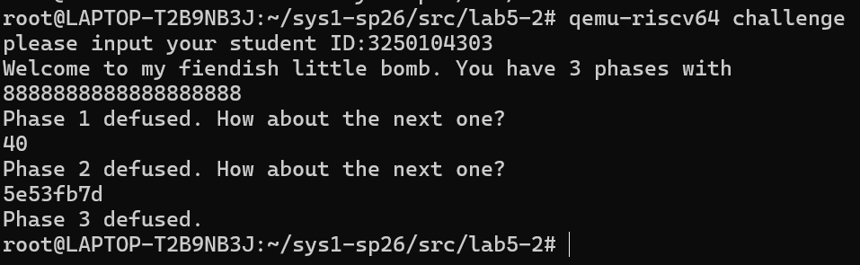
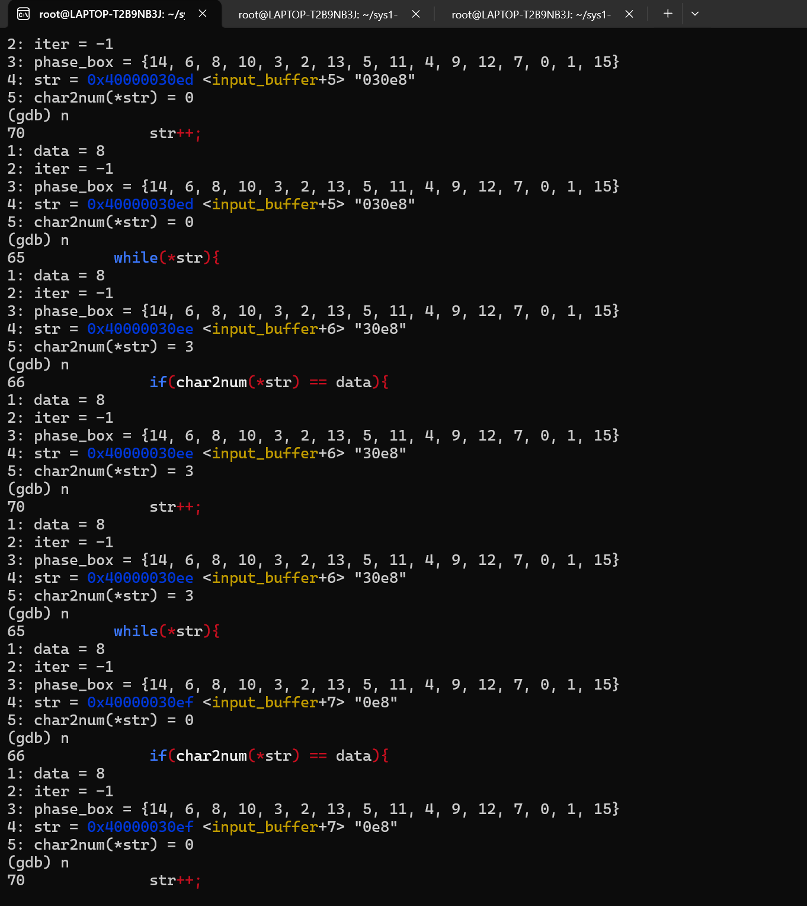
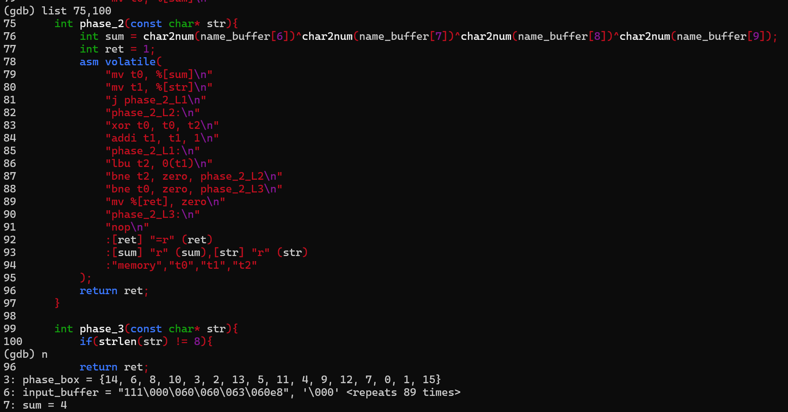
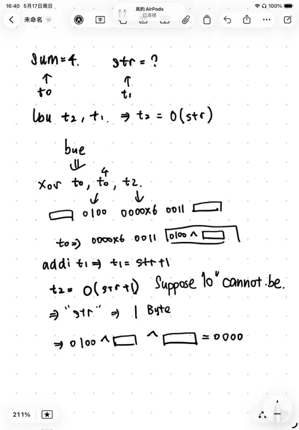
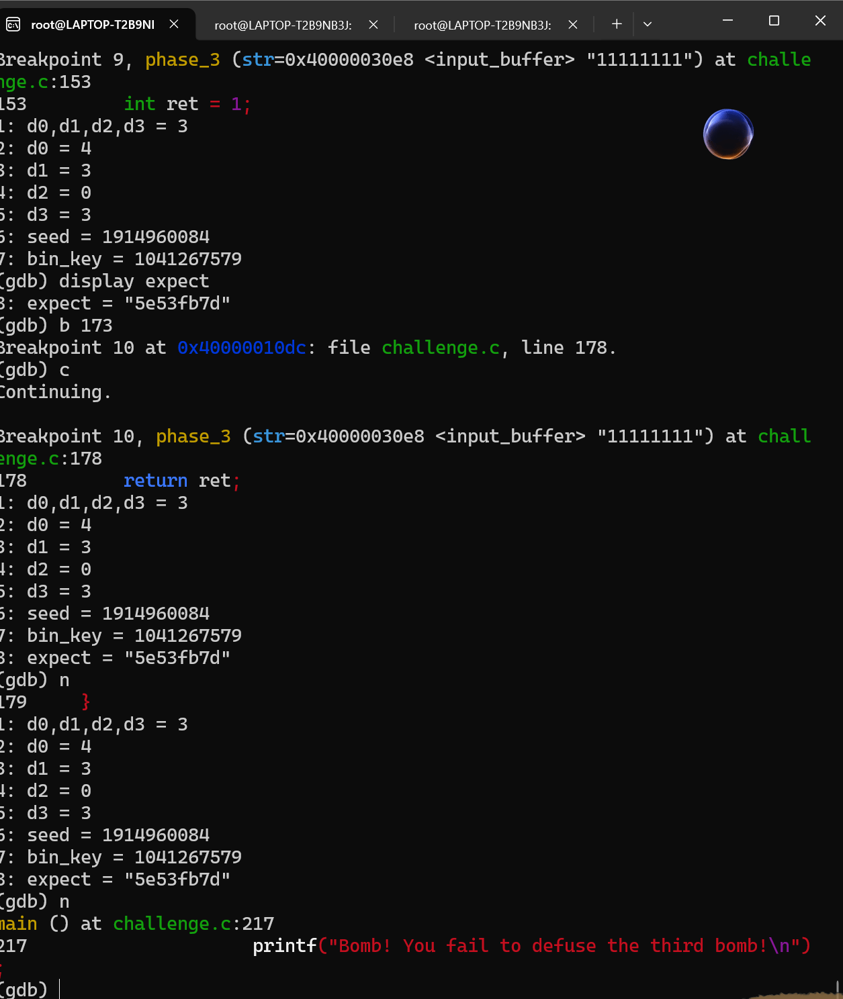
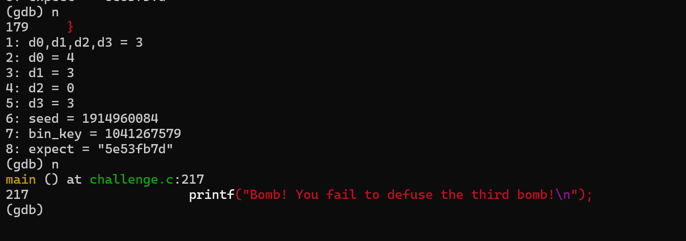

# lab5-1

### 理解简单 RISC-V 程序 10%
## 请阅读 `src/lab5-1/acc_plain.s` 回答以下问题 :
```r
    .file   "acc.c"

    .option pic

    .text

    .align  1

    .globl  acc

    .type   acc, @function

acc:

    addi    sp,sp,-48

    sd  s0,40(sp)

    addi    s0,sp,48

    sd  a0,-40(s0)

    sd  a1,-48(s0)

    sd  zero,-32(s0)

    ld  a5,-40(s0)

    sd  a5,-24(s0)

    j   .L2

.L3:

    ld  a4,-32(s0)

    ld  a5,-24(s0)

    add a5,a4,a5

    sd  a5,-32(s0)

    ld  a5,-24(s0)

    addi    a5,a5,1

    sd  a5,-24(s0)

.L2:

    ld  a4,-24(s0)

    ld  a5,-48(s0)

    ble a4,a5,.L3

    ld  a5,-32(s0)

    mv  a0,a5

    ld  s0,40(sp)

    addi    sp,sp,48

    jr  ra

    .size   acc, .-acc

    .ident  "GCC: (Ubuntu 11.4.0-1ubuntu1~22.04) 11.4.0"

    .section    .note.GNU-stack,"",@progbits
```

### `acc` 是如何获得函数参数的，又是如何返回函数返回值的？2%
	前两个参数a,b分别通过 `a0` 和 `a1` 寄存器传入。
	  返回值通过`a0`寄存器来返回。
### `acc` 函数中 `s0` 寄存器的作用是什么，为什么在函数入口处需要执行 `sd s0, 40(sp)` 这条指令，而在这条指令之后的 `addi s0, sp, 48` 这条指令的目的是什么？2%
- S0是帧指针，在栈指针在这个程序中起到了指示栈顶的作用。
- 在执行 `sd s0, 40(sp)`中是将S0的数据暂时存到40(sp)中，防止acc的函数将S0的数值改动
- 在执行`addi s0, sp, 48` 的时候是初始化当前的帧指针，使得S0的帧指针更新为新的指针
###  `acc` 函数的栈帧 (stack frame) 的大小是多少？1%
- 栈帧的大小是48字节
### `acc` 函数栈帧中存储的值有哪些，它们分别存储在哪（相对于 `sp` 或 `s0` 来说）？2%
- S0旧的s0是存放在0（sp)中
- a0是存放在8(sp)中
- a1是存放在0(sp)中
- 循环控制变量i是存放在24(sp)中
### 请简要解释 `acc` 函数中的 for 循环是如何在汇编代码中实现的。1%
- 初始化：在进入循环前，将零值写入 `-32(s0)`（初始化 `res = 0`），将参数 `a` 的值写入 `-24(s0)`。随后执行 `j .L2` 无条件跳转到条件检查部分。
- 条件检查 (`.L2`)：
    - 取出循环变量 `i`（`-24(s0)`）放入 `a4`，取出结束边界参数 `b`（`-48(s0)`）放入 `a5`。
    - 执行 `ble a4, a5, .L3`（意为：如果 $i \le b$，则跳转到 `.L3` 执行循环体）。
    - 如果 $i > b$，则不跳转，直接向下执行，退出循环。
- 循环体与自增 (`.L3`)：
    - **累加**：读取当前的 `res` 和 `i` 进行加法，结果写回 `res`（`-32(s0)`）。
    - **自增**：读取 `i` 的值，执行 `addi a5, a5, 1` 将其加 1，然后写回 `i`（`-24(s0)`）。
    - 执行完 `.L3` 的代码后，程序会自然顺序向下再次进入 `.L2` 进行条件检查，从而形成循环。

## `src/lab5-1/acc_opt.s` 也是 `src/lab5-1/acc.c` 对应的一种汇编程序，它由另一种命令生成：

|`riscv64-linux-gnu-gcc -S acc.c -O2 -o acc_opt.s`|

### 请阅读 `src/lab5-1/acc_opt.s` 回答以下问题：

1. 请查阅资料简要描述编译选项 `-O0` 和 `-O2` 的区别。1%
-  -O0 是指的是optimization level 0 无优化：编译器不进行代码转换，会频繁地访问内存。每条 C 语言语句通常都能对应到几条明确的汇编指令。
- - O2 指的是optimization level 2高级优化
   **特点**：
- 寄存器分配优化：尽可能将变量留在寄存器中，避免昂贵的内存（栈）访问。
- 控制流优化：重排代码块，减少分支跳转次数。
- 指令调度：调整指令顺序以利用处理器的流水线性能。
- 代码简化：消除死代码或进行常量折叠。

1. 请简要讨论 `src/lab5-1/acc_opt.s` 与 `src/lab5-1/acc_plain.s` 的优劣。1%
  - acc_plain.s 的优点：便于调试
  - acc_plains的缺点：性能极低，代码冗余
  - acc_opts.s的优点 ：性能极高，栈的开销小，代码十分紧凑
  - acc_opts.s的缺点：调试困难，编译略慢

### 理解递归汇编程序 15%
```r
        .text
        .globl  factor
factor:
        addi    sp,sp,-32
        sd      ra,24(sp)
        sd      s0,16(sp)
        addi    s0,sp,32
        sd      a0,-24(s0)
        ld      a5,-24(s0)
        bne     a5,zero,.L2
        li      a5,1
        j       .L3
.L2:
        ld      a5,-24(s0)
        addi    a5,a5,-1
        mv      a0,a5
        call    factor
        mv      a4,a0
        ld      a5,-24(s0)
        mul     a5,a4,a5
.L3:
        mv      a0,a5
        ld      ra,24(sp)
        ld      s0,16(sp)
        addi    sp,sp,32
        jr      ra
```


请阅读 `src/lab5-1/factor_plain.s` 回答以下问题 :

1. 为什么 `src/lab5-1/factor_plain.s` 中 `factor` 函数的入口处需要执行 `sd ra, 24(sp)` 指令，而 `src/lab5-1/acc_plain.s` 中的 `acc` 函数并没有执行该指令？2%
- 因为`factor`函数是一个递归函数，`call factor`指令会调用自身，如果没有`ra`函数，则会覆盖返回地址寄存器`ra`为了能够返回原来的`factor`函数的地址，所以要用`ra`。
2. 请解释在 `call factor` 前的 `mv a0, a5` 这条汇编指令的目的。2%
- 在`riscv`语言中函数中传入的整数通过a0传入函数。`a5`中存的是`n-1`的值，使得`call factor`等价于`factor(n-1)`。
3. 请简要描述调用 `factor(10)` 时栈的变化情况；并回答栈最大内存占用是多少，发生在什么时候。3%
 - 调用时，栈指针sp减少了32字节，用来分配栈帧，经过调用之后，每一次函数的调用都会使栈上分配一个新的32字节的栈帧，最大的占用内存大小为352字节。
4. 假设栈的大小为 4KB，请问 `factor(n)` 的参数 `n` 最大是多少？2%
         $n_{max}≤{{4096} \over 32}$
         解得：$n≤127$


`src/lab5-1/factor_opt.s` 也是 `src/lab5-1/factor.c` 对应的一种汇编程序，它由另一种命令生成：


`riscv64-linux-gnu-gcc -S factor.c -O2 -o factor_opt.s`

请阅读 `src/lab5-1/factor_opt.s` 回答以下问题 :

1. 请简要描述 `src/lab5-1/factor_opt.s` 和 `src/lab5-1/factor_plain.s` 的区别。2%
2. 请从栈内存占用的角度比较 `src/lab5-1/factor_opt.s` 和 `src/lab5-1/factor_plain.s` 的优劣。2%
3. 请查阅_尾递归优化_的相关资料，解释编译器在生成 `src/lab5-1/factor_opt.s` 时做了什么优化，该优化的原理，以及什么时候能进行该优化。2%

### 理解 switch 语句产生的跳转表 5%[¶](https://webvpn.zju.edu.cn/https/77726476706e69737468656265737421eafd54d134297b1e6e098ea98b1b393f9b77088ece7745/sys1/sys1-sp26/lab5-1/#%E7%90%86%E8%A7%A3-switch-%E8%AF%AD%E5%8F%A5%E4%BA%A7%E7%94%9F%E7%9A%84%E8%B7%B3%E8%BD%AC%E8%A1%A85 "Permanent link")

在 `src/lab5-1/switch.c` 中实现了一个简单的基于 switch 语句的函数`switch_eq` :
```c
int switch_eg(long long x, long long y) {     
long long result = y;     
switch (x) {     
case 20:         
result = result - 5;    
 case 21:         
 result = result + 19;         
 break;    
  case 22:         
  result += 11;         
  break;     
  case 24:     
  case 26:        
   result -= 20;         
   break;     
   default:         
   result = 0;     }     
   return result; }
```


`src/lab5-1/switch.s` 为该函数的汇编版本，由以下命令生成：

|   |
|---|
|`riscv64-linux-gnu-gcc -S switch.c -O2 -o switch.s`|
```r
	.text
	.globl	switch_eg
switch_eg:
	addi	a5,a0,-20
	li	a4,6
	bgtu	a5,a4,.L8
	lla	a4,.L4
	slli	a5,a5,2
	add	a5,a5,a4
	lw	a5,0(a5)
	add	a5,a5,a4
	jr	a5
	.section	.rodata
	.align	2
	.align	2
.L4:
	.word	.L7-.L4
	.word	.L6-.L4
	.word	.L5-.L4
	.word	.L8-.L4
	.word	.L3-.L4
	.word	.L8-.L4
	.word	.L3-.L4
	.text
.L3:
	addiw	a0,a1,-20
	ret
.L7:
	addi	a1,a1,-5
.L6:
	addiw	a0,a1,19
	ret
.L5:
	addiw	a0,a1,11
	ret
.L8:
	li	a0,0
	ret
```

请阅读这两个文件并回答以下问题 :

1. 请简述在 `src/lab5-1/switch.s` 中是如何实现 switch 语句的。2%
    - 先是进行一个范围的检查`addi a5,a0,-20`，`bgtu a5,a4,.L8`如果说大于6则返回0
    - 再使进行一个跳转表的遍历，即switch。先加载出跳转表的基地址`a4`,然后再计算出偏移量`slli a5,a5,2`,再相加得到目标的地址，最后再通过`jr a5`跳转到对应的case。
2. 请简述用跳转表实现 switch 和用 if-else 实现 switch 的优劣，在什么时候应该采用跳转表，在什么时候应该采用 if-else。3%
	- 优势：执行的效率高，跳转时间基本上恒定在O(1)，而且代码简洁。
	- 劣势，占用的内存大，需要大量的空间来储存跳转表，使用的范围有限，只能存储离散的取值。
```r
.text
.globl  bubble_sort
bubble_sort:
    addi sp,sp,-32# 栈指针向下移动32字节，为保存寄存器分配空间
    sd ra,24(sp)# 保存返回地址寄存器ra到栈中偏移24的位置
    sd s0,16(sp)# 保存s0寄存器到栈中偏移16的位置
    sd s1,8(sp)# 保存s1寄存器到栈中偏移8的位置
    sd s2,0(sp)# 保存s2寄存器到栈中偏移0的位置
    mv s0,a0# s0 = 数组首地址（参数a0）
    mv s1,a1# s1 = 数组长度n（参数a1）
    li s2,0# s2 = 外层循环变量i = 0
.L1:# 外层循环开始
    addi t0,s1,-1# t0 = n - 1
    bge s2,t0,.L_done# 如果i >= n-1，跳转到结束
    li t1,0# 内层循环变量j = 0
.L2:# 内层循环开始
    sub t2,s1,s2# t2 = n - i
    addi t2,t2,-1# t2 = n - i - 1
    bge t1,t2,.L1_next# 如果j >= n-i-1，跳转到外层循环的下一轮
    slli t3,t1,3# t3 = j * 8（每个元素8字节）
    add t3,s0,t3# t3 = &array[j]
    ld t4,0(t3)# t4 = array[j]
    ld t5,8(t3)# t5 = array[j+1]
    ble t4,t5,.L3# 如果array[j] <= array[j+1]，跳过交换
    sd t5,0(t3)# 将array[j+1]存入array[j]的位置
    sd t4,8(t3)# 将array[j]存入array[j+1]的位置
.L3:# 跳转目标（不交换时来到这里）
    addi t1,t1,1# j++
    j .L2# 继续内层循环
.L1_next:# 外层循环的下一次迭代
    addi s2,s2,1# i++
    j .L1# 继续外层循环
.L_done:# 排序完成
    ld ra,24(sp)# 从栈中恢复寄存器
    ld s0,16(sp)            
    ld s1,8(sp)           
    ld s2,0(sp)           
    addi sp,sp,32          
    ret                   
```


```r
.text
.globl  fibonacci
  
fibonacci:
    addi sp,sp,-32#栈帧每次下降32bit
    sd ra,24(sp)#设置前一个fibonacci函数的地址
    sd s0,16(sp)#n
    sd s1,8(sp)#前一个数
    sd s2,0(sp)#前两个数
    mv s0,a0#s0=a0
    li t0,0# 因为beq是能在寄存器中进行比较
    beq s0,t0,.Ldone #假入说两个数字是相等的0==n
    li t0,1
    beq s0,t0,.Ldone#假如说n==1
    addi a0,s0,-1 #a0=s0-1
    call fibonacci
    mv s1,a0 #a0=fibonacci(n-1)
    addi a0,s0,-2 #a0=s0-2
    call fibonacci
    mv s2,a0 # a0=fibonacci(n-2)
    add a0,s1,s2# fibonacci(n)=fibonacci(n-1)+fibonacci(n-2)
    j .L_return
.Ldone:
    li a0,1# 当n=0，1 的时候其值是1
.L_return:
    ld ra,24(sp)#返回栈的值，回到原来的函数中
    ld s0,16(sp)
    ld s1,8(sp)
    ld s2,0(sp)
    addi sp,sp,32
    ret
```

# lab5-2
## qemu的方法破解
### phase1
- 只要是字符串中含8即可
### phase2
- 要满足是两个数字`a,b`
- 还要满足 $4^a^b=0$
### phase3
- 输入`5e53fd7d`即可

## 下面展示推导的过程
### phase1
- 先是通过`b phase1`跳转到phase1的位置设置断点，再`c`跳转到断点。通过gdb的调试发现在代码的66行有一句`if(char2num(*str)==data)`的判断语句，而且通过`list data`的语句发现`data`的值为8，分析可知是字符串中只要存在8就可以通过

## phase2
- 我先通过`b phase2` `c`来定位到phase2的位置
- 然后通过尝试发现`list 75,100`能显示全部的phase2代码
- 通过`list sum`可以调出来sum的值是4

- 然后汇编的代码进行阅读，做出了如下的推理


- 发现要满足 $4^a^b=0$
- 经过实验发现40满足上面的答案
## phase3
- 用了phase2里面的方法之后找到phase3的代码部分，发现最终的input是和`expect`的函数进行比对的，查看了input的断点运行之后发现input的值并没有发现改变。
- 所以我只需要调用出来最终expect的值我就可以知道我应该输入什么值了

- 得到expect的值是`5e53fd7d`
