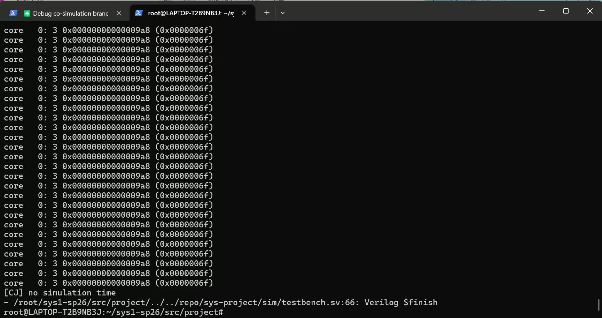
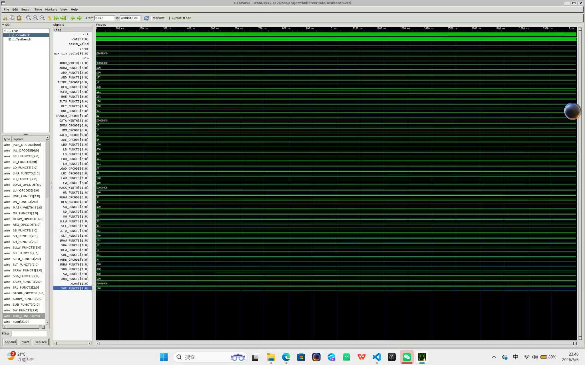
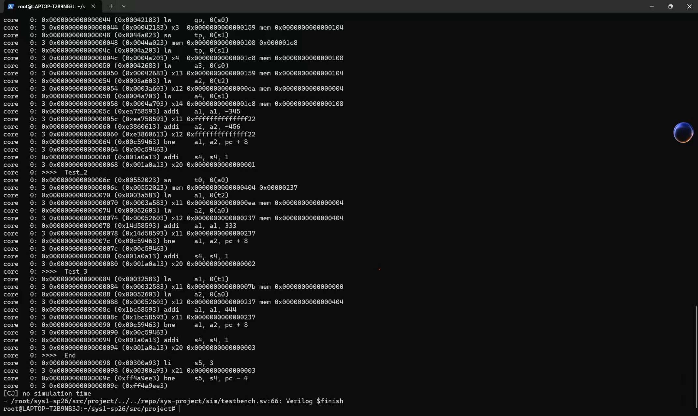

# sysproject — 单周期 CPU 设计实验报告

## 实验目的

- 了解 CPU 设计的基本原理
- 设计 CPU 数据通路
- 为之后搭起单周期 CPU 打下基础
- 结合上次实验中的数据通路模块，搭建单周期 CPU

## 实验环境

- 操作系统：Windows 10+ 22H2（WSL2），Ubuntu 22.04+
- 开发语言：Verilog，SystemVerilog
- 仿真工具：Verilator v5.002
- 综合工具：Vivado

## 实验过程

### 数据通路设计

我先按照实验一的要求，编写了各个部分的元器件，比如 `cmp.sv`、`regfile.sv`、`alu.sv` 等文件组件。

整体框架按五个阶段来搭：

- **IF 阶段**：PC 模块负责取指令地址，通过 imem 端口从内存获取 32 位指令，传入 `controller.sv`。
- **ID 阶段**：在 `controller.sv` 中解码指令，生成控制信号；寄存器堆读出操作数。控制单元我用了二段译码的方式：第一段根据 opcode 判断指令大类（R/I/S/B/U/J），第二段根据指令大类给各控制信号赋值。这样代码量少，后面改信号也方便。
- **EXE 阶段**：编写 `ALU.sv` 和 `CMP.sv` 执行运算。ALU 根据 `alu_op` 做加减、移位、逻辑运算等；CMP 处理分支比较，输出 `br_taken`。Imm Gen 从指令中提取立即数。
- **MEM 阶段**：编写 `Data Package.sv`、`Data Mask`、`Data Truncation.sv` 处理寄存器和内存之间的数据交互。Data Package 把数据按位宽打包对齐，Data Mask 生成字节掩码，Data Truncation 做读回数据的截断和符号扩展。
- **WB 阶段**：通过 `wb_sel` 信号选择 ALU 结果、内存数据或 PC+4 写回寄存器堆。

整体上，各个阶段通过 `Core.sv` 串联起来，`cosim_core_info` 信号引出给 difftest 做差分对比。







### 仿真测试

在 `project/include/initial_mem.vh` 中把 `FILE_PATH` 改成测试 hex 文件的路径，然后在 `src/project` 下跑：

```bash
make TESTCASE=xxx   # 编译测试样例
make verilate        # 跑仿真
make wave            # 看波形
```

测试样例逐个过：先把 rtype 调通（R 型指令），然后 itype、stype、btype、utype、jtype、remain，最后 full 全指令测试跑通。碰到问题主要靠 gtkwave 看波形定位，大多是控制信号赋值的问题。


### 上板验证

跑 `make board_sim TESTCASE=full` 生成下板用的 hex 文件，然后 `make bitstream` 生成 bit 流烧进 FPGA。上板后通过开关选监视信号，拨 `switch[15]` 进调试模式，按中央按钮单步执行。最后 pc 停在 `0x9a8` 死循环地址，说明全部指令正确跑完。

## 实验结果

- 全部测试样例仿真通过（rtype / itype / stype / btype / utype / jtype / remain / full）
- 上板验证通过，CPU 正确执行测试程序

## 心得体会

波形图是真的好用，一开始盯着代码看半天找不到 bug，打开 gtkwave 一条条对很快就定位了。二段译码比一段译码好维护太多了，中间改了几次控制信号都挺顺的。RV64I 部分指令和 RV32I 语义有区别（比如移位指令的范围），一开始没注意后来翻手册才发现，修了半天。整体框架的 difftest 很实用，Makefile 脚本也省了不少事。
