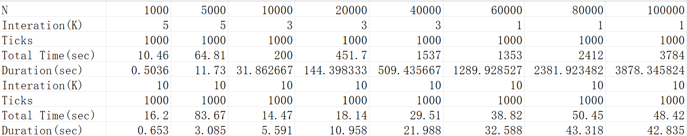
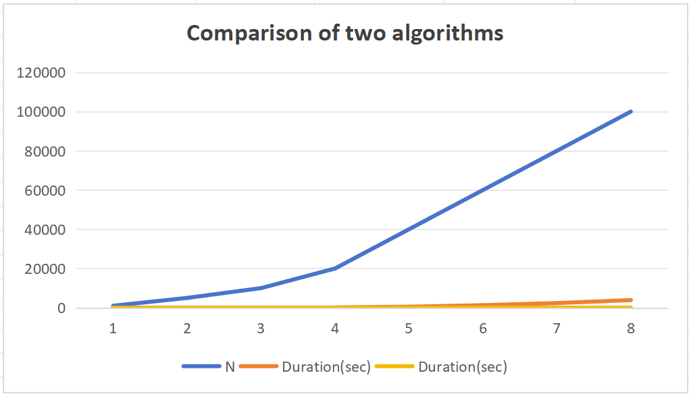

# Comparison of two algorithms

  

## Author's Name: Wei Lan Evelina
  

### DATA: 2026-03-11

  

***

  

#### Chapter1: Introduction

  

**Performance Measurement:**

  

- Given $S$ as a collection of $N$ positive integers that are no more than $V$. For any given number $c$, you are supposed to find two integers $a$ and $b$ from $S$, so that $a+b=c$.

  

- And the following will give two typical algorithms to compare their time conplexity.

  

#### Chapter2: Algorithm Specification

  

- General explanation: the two algotithms adopted ```srand()```&```rand()``` to gennerate random number to make sure the randomness. Also, they adopt repetition factor to ensure the accuracy.

  

##### algorithm 1:

  

```c

  

#include<stdio.h>

  

#include<time.h>

  

#include<stdlib.h>

  

clock_t start,stop;

  

double duration;

  

int main(){

  

    int s[100000]; //a collection that contain the elements of N

  

    int v;// defining the maximum number

  

    int c;//defining the targeted number

  

    int N;//defining the total number

  

    printf("PLS input maximum,targeted number and total number");

  

    scanf("%d %d %d",&v,&c,&N);//inputing the maximum number & targeted number

  

    srand(time(NULL));

  

    for(int i=1;i<=N;i++){

  

        /*scanf("%d",&s[i-1]);//inputing the elements of s

  

        if (s[i-1]>v){//check if the input number exceeds the boundary

  

            printf("the entered number exceeds the maximum value!!");

  

            return 0;//the version that need to input number by hand

  

        }*/

  

        s[i-1]=rand()%v+1;

  

    }

  

    // the algorithm 1 adopted is two-double traversal method. the following is the main part of the function.

  

    //i&j contain the targeted-position information

  

    int K=100;

  

    for(int m=1;m<=K;m++){//to ensure the accuracy by running the program repeatedly

  

    start=clock();

  

    int number=0; //finding the total targeted number

  

    for(int i=0;i<=N-2;i++){//traverse every posible combinations

  

        for(int j=i+1;j<=N-1;j++){

  

              if(s[i]+s[j]==c){

  

                    printf("(%d , %d)\n",s[i],s[j]);//outputing the targeted number

  

              }

  

        }

  

    }

  

    stop=clock();

  

    duration+=((double)(stop-start)/CLK_TCK);//number of ticks per second.

  

}

  

    printf("the running time is %f",duration/K);

  

}

  

```

  

- This one adopts two-double traversal method. We need to traverse all the posible situation by two-double circulation.Because of its loop structure, the time complexity reaches $O(N^2)$.

  

##### Algorithm 2:

  

  

```c

  

#include<stdio.h>

  

#include<time.h>

  

#include<stdlib.h>

  

clock_t start,stop;

  

double duration;

  

int main(){

  

    int s[100000]; //a collection that contain the elements of N

  

    int hash[100000]={0};

  

    int v;// defining the maximum number

  

    int c;//defining the targeted number

  

    int N;//defining the total number

  

    printf("PLS input maximum,targeted number and total number");

  

    scanf("%d %d %d",&v,&c,&N);//inputing the maximum number & targeted number

  

    srand(time(NULL));

  

    for(int i=1;i<=N;i++){

  

        /*scanf("%d",&s[i-1]);//inputing the elements of s

  

        if (s[i-1]>v){//check if the input number exceeds the boundary

  

            printf("the entered number exceeds the maximum value!!");

  

            return 0;//the version that need to input number by hand

  

        }*/

  

        s[i-1]=rand()%v+1;

  

    }

  

  

    //the algorithms 2 is based on the hash algorithms

  

    start=clock();

    for(int k=0;k<=9;k++)//to ensure the accuracy by running the program repeatedly

    for (int i=0;i<N-1;i++){

  

            hash[s[i]]=1;// to mark this number

  

            if(s[i]<c&&hash[c-s[i]]==1){// to find if the targeted number has already appeared.

  

                printf("(%d , %d)\n",s[i],c-s[i]);

  

            }

  

    }

  

    stop=clock();

  

    duration=((double)(stop-start))/CLK_TCK;

  

    printf("%f",duration);

  

}

  

```

  

- This algorithm adopts hash algorithm. It can traverse for only one loop and it is the most effective one I have thought.The time complexity is $O(N)$,far above that in algorithm 1.

  

- The main strategy of algorithm 2 is to mark the number that has already appeared and check if the targeted number--the one that adds the giving number is $c$ --has already appeared. If it is ,than put it out.

  

  

#### Chapter3:Testing result

  

##### Experimental Setup

- To empirically validate the theoretical complexity analysis, both algorithms were tested under identical conditions:

  

Compiler: devc++ version 5

  

Input Parameters: N ranging from small to large values, V = 10000, c randomly chosen

  

Measurement: Each data point represents the average of 100 runs to ensure statistical significance

  

- the following is the testing result.

  



  
  

- the following is the comparison graph. ps:the bule one is for algorithm 1 and the yellow one is for algorithm 2.

  



  

- The result clearly demonstrate the superiority of algorithm 2 for the large input. As the N increases,  algorithm2 is increasing linearing .

  
  
  

  

#### Charpter 4 : Analysis and Comments

  

##### Time and space complexity:

  

**algorithm1**:

  - ANALYSIS：- The algorithm employs two nested loops to examine all possible unordered pairs of elements
- The outer loop runs from `i = 0` to `N-2`, iterating N-1 times
- For each iteration of the outer loop, the inner loop runs from `j = i+1` to `N-1`
- The total number of comparisons is:
$$
(N-1) + (N-2) + ... + 2 + 1 = N(N-1)/2 ≈ N²/2
$$

- the time complexity is $O(N^2)$ and the space complexity is $O(N)$.

  

- It can be completely improved. So I introduce algorithm 2.

  

  

**algorithm 2**:

  
- ANALYSIS:The main loop runs exactly N times (from `i = 0` to `N-1`)
- Inside the loop, each operation is constant time O(1):

-  $\therefore$ the time complexity is $O(N)$ and the space complexity is $O(V)$.

  

- I think this algorithm is almost the most effective one, because you should at least traverse the whole number . And the searching movement has already reached $O(N)$.

  

- And I think the future improvement for this algorithm should be focused on the space complexcity.

  

##### conclusion

  

| Aspect           | algorithm1 | algorithm 2 |
| ---------------- | ---------- | ----------- |
| time efficiency  | poor       | excellent   |
| space efficiency | based on N | based on V  |

  
  

#### Declaration

  

- I hereby declare that all the work done in this project titled "Comparison of two algorithms" is of my independent effort